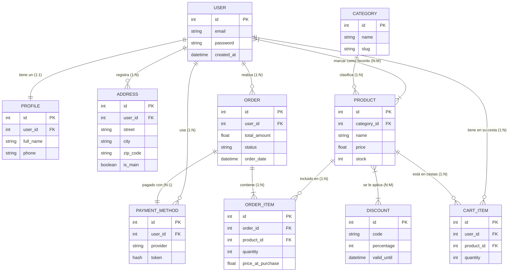
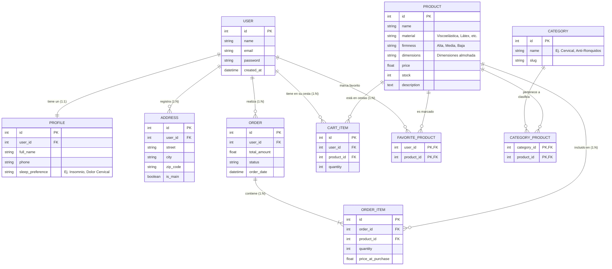

# Esquema de Base de Datos (E-Commerce de Almohadas)

Este diagrama UML estructurado en formato Entidad-Relación representa la base de datos para la tienda de almohadas ergonómicas. Ha sido refactorizado para cumplir fielmente con el informe `Inf-E-Comerce.md` y los requisitos de la EPD3 (Asegurando la existencia de relaciones 1:1, 1:N y N:M con el desglose de tablas pivote requeridas para Laravel).

## Esquema Genérico

## Esquema Refactorizado

## Justificación de la Refactorización

La refactorización de este diagrama UML obedece a razones clave tanto de negocio (adaptación al nicho) como técnicas (alineación con Laravel y los problemas de la EPD3):

1. **Adaptación al Nicho de Mercado**: Se ha ampliado la entidad `PRODUCT` con atributos clave específicos de almohadas, como `material` (viscoelástica, látex), `firmness` (firmeza de la almohada) y `dimensions`. De igual forma, la entidad `PROFILE` ahora permite registrar la preferencia de sueño del usuario (`sleep_preference`), posibilitando luego recomendaciones hiper-personalizadas (ej. almohadas para dolor cervical o insomnio).
2. **Cumplimiento Estricto del Problema 3 (Categorías)**: El esquema genérico original contemplaba erróneamente una relación 1:N estructural. Se ha eliminado y sustituido por la tabla pivote `CATEGORY_PRODUCT`, haciendo explícita la relación N:M exigida por el enunciado; así, una almohada concreta puede pertenecer a múltiples categorías simultáneas (ej. "Anti-ronquidos" y "Ortopédica") y viceversa.
3. **Cumplimiento Estricto del Problema 5 (Favoritos)**: Para cumplir con la funcionalidad de la *Wishlist* orientada a las analíticas de administración ("likes"), se añadió de manera patente la tabla pivote `FAVORITE_PRODUCT`. Esto materializa correctamente la relación cardinal N:M entre `USER` y `PRODUCT`.
4. **Traducción directa hacia Laravel Eloquent**: Al separar y exponer explícitamente las tablas pivote (`CATEGORY_PRODUCT` y `FAVORITE_PRODUCT`) en el esquema en lugar de dejarlas implícitas, se mapea con exactitud milimétrica la naturaleza de la base de datos relacional y cómo el futuro ORM de código (relaciones `belongsToMany`) las gestionará. Esto sirve como el plano exacto para la inminente creación de nuestras Migraciones SQL.
