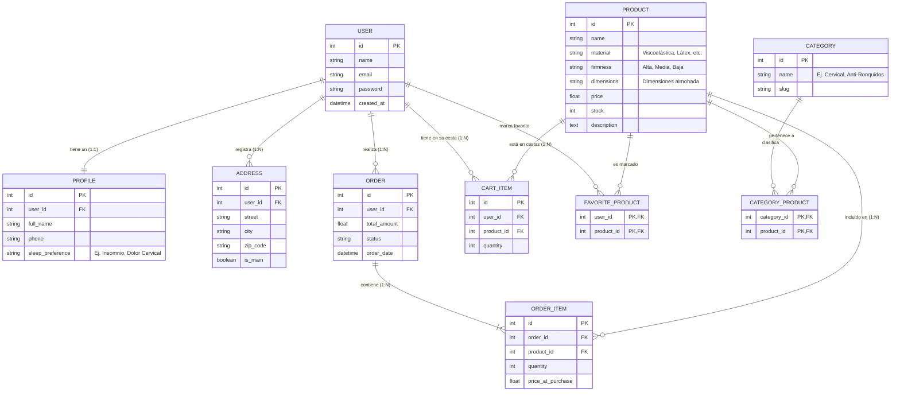
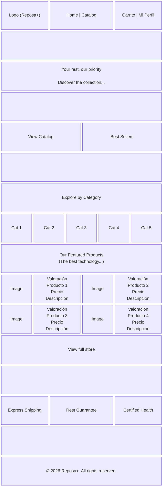
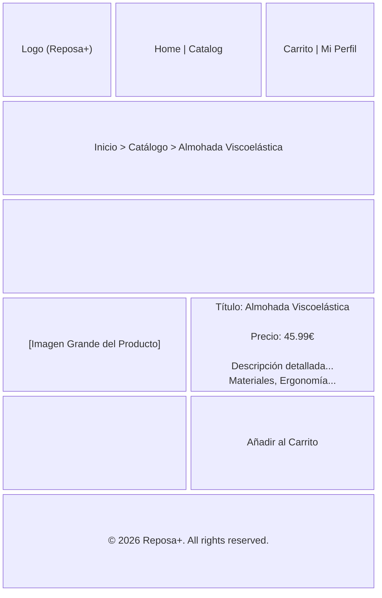

# Memoria del Proyecto: Reposa+
## Desarrollo de un E-commerce Especializado en Descanso Ergonómico Mediante Laravel y Bootstrap 5

### Project Definition (English)
**Reposa+** is an advanced, hyper-specialized e-commerce platform dedicated to ergonomic rest and wellness. Built from scratch using Laravel 11 and Docker, it offers a fast, secure, and accessible shopping experience. Key features include role-based access control (RBAC), an atomic transactional checkout process, multi-language support (i18n), and a custom-built shopping cart capable of handling guest sessions and authenticated users alike.

### Definición del Proyecto (Español)
**Reposa+** es una plataforma de e-commerce hiper-especializada dedicada al descanso ergonómico y el bienestar. Construida desde cero utilizando Laravel 11 y Docker, ofrece una experiencia de compra rápida, segura y accesible. Sus funcionalidades principales incluyen control de acceso basado en roles (RBAC), un proceso de pago con transacciones atómicas en la base de datos, soporte multi-idioma (i18n) y un carrito de compras a medida capaz de gestionar tanto sesiones de invitados como de usuarios autenticados.

---

## Índice General
0. Abstract / Definición del Proyecto
1. Introducción
2. Estado del Arte
3. Objetivos y Requisitos
4. Diseño y Arquitectura
5. Desarrollo e Implementación
6. Pruebas y Resultados
7. Conclusiones y Trabajo Futuro
8. Bibliografía
9. Anexo A: Documentación de Despliegue con Docker

---

## 1. Introducción

### 1.1. Contexto y Motivación
En la sociedad contemporánea, el ritmo de vida acelerado, el estrés crónico y el uso prolongado de dispositivos electrónicos han provocado una crisis silenciosa pero generalizada: el deterioro de la calidad del sueño. La falta de un descanso reparador no solo afecta el rendimiento cognitivo y físico diario, sino que está directamente relacionada con patologías crónicas a largo plazo, incluyendo trastornos musculoesqueléticos como el dolor cervical crónico. Según diversos estudios de la Organización Mundial de la Salud (OMS), un porcentaje significativo de la población mundial sufre de insomnio ocasional o crónico, y gran parte de estas afecciones están vinculadas a una mala higiene postural durante el sueño.

En este contexto socio-sanitario, surge la necesidad de ofrecer soluciones accesibles y especializadas que aborden el problema desde la ergonomía y la tecnología. Si bien el mercado de colchones y almohadas es vasto, gran parte del comercio electrónico tradicional enfoca sus esfuerzos en la venta generalista, diluyendo el asesoramiento técnico y la propuesta de valor enfocada en la salud. 

**Reposa+** nace como respuesta a esta problemática. Se trata de un ecosistema de comercio electrónico (e-commerce) hiper-especializado en el nicho del descanso ergonómico e inteligente. La premisa fundamental del proyecto no es la mera comercialización de un producto textil, sino la provisión de una solución de salud. El lema que rige la plataforma, *"No vendemos almohadas, vendemos noches de sueño profundo y reparador"*, resume la filosofía de la marca y guía todas las decisiones de diseño arquitectónico y de interfaz de usuario.

### 1.2. Justificación Tecnológica
Desde la perspectiva técnica, el desarrollo de plataformas de comercio electrónico modernas exige altos estándares de seguridad, escalabilidad y experiencia de usuario (UX). Actualmente, el mercado tecnológico ofrece múltiples vías para la creación de tiendas online, desde los Sistemas de Gestión de Contenidos (CMS) monolíticos y las plataformas de Software como Servicio (SaaS) hasta los desarrollos a medida.

Este Trabajo se enmarca en la necesidad de demostrar competencias avanzadas de Ingeniería del Software mediante la construcción de un sistema transaccional robusto desde cero. Por ello, se ha prescindido de soluciones prefabricadas (como Shopify o PrestaShop) en favor de un desarrollo a medida utilizando **Laravel**, el framework PHP más consolidado de la industria para aplicaciones web de nivel empresarial. La adopción de Laravel garantiza el cumplimiento del patrón arquitectónico Modelo-Vista-Controlador (MVC), una gestión segura del ciclo de compra y una absoluta flexibilidad para iteraciones futuras.

Asimismo, el proyecto incorpora un enfoque vanguardista al integrar un **Ecosistema de Agentes de Inteligencia Artificial** en su ciclo de desarrollo. Esta metodología representa un salto evolutivo en la Ingeniería de Software, donde la IA no actúa meramente como un asistente de codificación, sino como una red de agentes autónomos con reglas, habilidades (skills) y flujos de trabajo (workflows) definidos que aseguran la integridad del código, la cohesión del diseño y la cobertura de pruebas.

### 1.3. Ámbito de Aplicación y Relevancia Académica
El proyecto se desarrolla como respuesta a los requisitos académicos establecidos en la Asignatura "EPD 3: Frameworks – Laravel". Constituye una prueba integradora de conocimientos que abarca desde la conceptualización de la base de datos y la administración de sistemas, hasta la implementación de interfaces de usuario asíncronas y el despliegue en entornos virtualizados.

La relevancia de este trabajo radica en la combinación de un caso de negocio realista (con requerimientos estrictos de usabilidad y conversión) con una ejecución técnica rigurosa. A lo largo del documento se detallará cómo se han superado los distintos retos de ingeniería: la gestión concurrente del carrito de la compra, el manejo de roles y permisos mediante *middlewares*, la internacionalización de la plataforma (multi-idioma) y la persistencia segura de las transacciones (checkout).

---

## 2. Estado del Arte

La concepción y el desarrollo de **Reposa+** requieren un análisis exhaustivo tanto del entorno de mercado en el que operará la plataforma, como de las tecnologías subyacentes elegidas para su construcción. Este análisis del "Estado del Arte" se divide en tres ejes fundamentales: la evolución del e-commerce enfocado en la salud y el bienestar, el panorama actual de las arquitecturas de desarrollo web (CMS vs. Frameworks), y el paradigma emergente del desarrollo de software asistido por ecosistemas de Agentes de IA.

### 2.1. El Mercado del Descanso y el E-commerce de Nicho
Durante la última década, el comercio electrónico ha transitado de la masificación (grandes *marketplaces* como Amazon o AliExpress) hacia la hiper-especialización. Los consumidores, especialmente en el sector de la salud y el bienestar, demandan plataformas que ofrezcan autoridad, confianza y un asesoramiento detallado sobre productos que impactarán en su calidad de vida.

#### 2.1.1. Tendencias en la Industria del Bienestar y la Ergonomía
El mercado del descanso, denominado en inglés *Sleep Tech & Ergonomics*, ha experimentado un crecimiento exponencial. Ya no se trata únicamente de adquirir una cama, sino de optimizar la recuperación muscular, alinear la columna vertebral y regular la temperatura corporal durante la fase REM. Productos como almohadas viscoelásticas con memoria de forma, cojines térmicos cervicales y sistemas de monitorización del sueño son ahora productos de alta demanda. 

Sin embargo, el reto de comercializar estos productos de forma online radica en la "intangibilidad". Al no poder probar la almohada físicamente, la interfaz de usuario (UI) y la experiencia de usuario (UX) deben suplir esta carencia mediante una arquitectura de información cristalina, fotografías detalladas, descripciones que apelen tanto a la lógica (materiales, densidad) como a la emoción (alivio, confort), y un diseño visual que transmita la sensación de descanso antes incluso de que el producto sea añadido al carrito.

#### 2.1.2. La Psicología del Color en Entornos Digitales de Salud
El diseño web contemporáneo se apoya fuertemente en la psicología del color para modular el comportamiento y las emociones del usuario. En el contexto de Reposa+, se ha realizado un estudio cromático que determina que los colores cálidos o vibrantes (rojos, naranjas), a menudo usados para estimular compras impulsivas en *retail*, son contraproducentes para un nicho que busca reducir el estrés.

Por consiguiente, el estado del arte en diseño de aplicaciones para el sueño (como las apps Calm o Headspace) se fundamenta en el uso del color **Índigo / Blue-Indigo** y los azules profundos. Estos tonos están biológica y psicológicamente asociados a la noche, la profundidad, la serenidad y el ritmo circadiano. Al bañar la interfaz del e-commerce con una paleta de colores desaturados y azules nocturnos, la plataforma induce un estado de relajación que alinea la percepción visual del cliente con la propuesta de valor del producto.

### 2.2. Tecnologías de Comercio Electrónico: CMS vs Frameworks a Medida
A nivel de Ingeniería del Software, el desarrollo de una tienda online presenta una dicotomía histórica: utilizar una solución empaquetada o desarrollar el sistema desde cero.

#### 2.2.1. Soluciones CMS y SaaS
En la actualidad, plataformas como Shopify, WooCommerce (sobre WordPress), PrestaShop y Magento dominan el mercado de pequeñas y medianas empresas.
*   **WooCommerce y PrestaShop:** Ofrecen una rápida curva de entrada y multitud de *plugins*. Su principal desventaja es el denominado "bloatware": exceso de código innecesario, problemas de rendimiento a gran escala y vulnerabilidades de seguridad debido a la dependencia de módulos de terceros.
*   **Shopify:** Como modelo SaaS (Software as a Service), proporciona infraestructura gestionada. Sin embargo, impone altas comisiones por transacción, limita el control absoluto sobre el código fuente (bloqueo tecnológico o *vendor lock-in*) y dificulta la implementación de lógicas de negocio altamente personalizadas.

#### 2.2.2. Frameworks Empresariales (Laravel)
Frente a las limitaciones de los CMS, el desarrollo con *frameworks* representa el estándar para proyectos que exigen escalabilidad y propiedad total sobre los datos. En el ecosistema PHP, **Laravel** se ha consolidado como el líder indiscutible frente a alternativas como Symfony o CodeIgniter.

Laravel proporciona un entorno de desarrollo elegante y expresivo. Su arquitectura Modelo-Vista-Controlador (MVC) fuerza una separación limpia de responsabilidades (las reglas de negocio en los controladores y modelos, la presentación en las vistas de Blade). Además, el framework incluye de fábrica subsistemas esenciales para un e-commerce complejo, tales como:
*   **Eloquent ORM:** Una abstracción de base de datos que permite manejar relaciones complejas (1:N, N:M) como el cruce entre "Productos", "Pedidos" y "Categorías" de manera intuitiva y segura frente a inyecciones SQL.
*   **Sistema de Enrutamiento y Middleware:** Que permite proteger rutas sensibles (como el proceso de Checkout o el Panel de Administración) validando roles y sesiones sin acoplar el código.
*   **Gestor de Colas (Queues) y Jobs:** Fundamental para enviar correos electrónicos transaccionales (confirmaciones de pedido vía SMTP) en segundo plano (asíncronamente), evitando que el usuario sufra tiempos de carga excesivos tras presionar el botón de pago.

La elección de Laravel para Reposa+ no solo responde a un requerimiento académico, sino a la alineación con las mejores prácticas de la industria actual para construir sistemas mantenibles a largo plazo.

### 2.3. Desarrollo Orientado por Ecosistemas de Agentes de IA
Un aspecto diferenciador y vanguardista del proyecto Reposa+ es la utilización del marco de trabajo **Antigravity SDK**, el cual representa el estado del arte en Inteligencia Artificial aplicada a la Ingeniería del Software.

Históricamente, los asistentes de IA generativa (como ChatGPT o GitHub Copilot) han funcionado como "oráculos" reactivos o completadores de código en línea, dependientes de indicaciones aisladas del desarrollador humano. El paradigma de los **Agentes de IA** da un paso más allá al crear entidades autónomas dotadas de contexto, herramientas de lectura/escritura del sistema de archivos y capacidades de terminal.

En el caso de este proyecto, se ha configurado un directorio oculto `.agents/` en la raíz del proyecto que define el comportamiento del sistema experto, subdividido en:
*   **Reglas (Rules):** Documentos de identidad que dictan el comportamiento estricto. Por ejemplo, `agent_ui_ux.md` fuerza a la IA a utilizar la paleta de colores índigo y clases específicas de Bootstrap 5, evitando regresiones en el diseño. Por otro lado, `agent_database.md` obliga a respetar el modelo Entidad-Relación y a optimizar las consultas de Eloquent para evitar problemas de N+1.
*   **Habilidades (Skills):** Módulos acoplables, como el `laravel-specialist`, que otorgan a los agentes el conocimiento experto sobre PHP 8.3+, inyección de dependencias y convenciones de nombrado RESTful.
*   **Flujos de Trabajo (Workflows):** Procedimientos estandarizados (`feature_generation.md`, `purchase_flow_test.md`) que los agentes ejecutan paso a paso, automatizando tareas pesadas como la internacionalización completa de los archivos `.blade.php` o la generación de seeders masivos para poblar la base de datos con productos de prueba.

La integración de este ecosistema de agentes no reemplaza al ingeniero humano, sino que actúa como un sistema de pair-programming hiper-acelerado, reduciendo la deuda técnica, garantizando el cumplimiento de estándares y permitiendo al desarrollador centrarse en la arquitectura de alto nivel y las decisiones de negocio críticas. Esta sinergia humano-máquina constituye la frontera tecnológica actual en el desarrollo ágil de aplicaciones web complejas.

---

## 3. Objetivos y Requisitos

La definición clara de los objetivos y requisitos es un paso fundamental en la metodología de Ingeniería del Software, ya que establece la línea base contra la cual se validará el éxito del proyecto. Para Reposa+, los requisitos funcionales y no funcionales emanan directamente de las directrices académicas de la EPD 3 de Frameworks.

### 3.1. Objetivos Principales del Proyecto
El objetivo general es diseñar, desarrollar y desplegar una plataforma de comercio electrónico realista, escalable y segura orientada a un nicho de mercado específico (descanso ergonómico), demostrando dominio absoluto sobre el framework Laravel y las tecnologías de frontend asociadas.

De este objetivo general se desprenden los siguientes objetivos específicos (O.E.):
*   **O.E. 1 (Arquitectura de Datos):** Diseñar una base de datos relacional robusta que modele de forma precisa entidades complejas y garantice la presencia obligatoria de relaciones cardinales 1:1, 1:N y N:M.
*   **O.E. 2 (Flujo Transaccional):** Implementar el caso de uso central de todo e-commerce: el ciclo de compra de un producto, desde la exploración anónima hasta la persistencia segura del pedido, pasando por la gestión asíncrona del carrito.
*   **O.E. 3 (Seguridad y Roles):** Garantizar la segregación de privilegios mediante un sistema dual de autenticación, separando estrictamente las capacidades de los usuarios finales (clientes) de los administradores del sistema.
*   **O.E. 4 (Internacionalización):** Proporcionar una experiencia de usuario global (i18n) mediante la implementación de soporte multi-idioma nativo.
*   **O.E. 5 (Fidelización):** Desarrollar mecánicas de retención de clientes, concretamente un sistema de "Lista de Favoritos" que, a su vez, retroalimente las métricas analíticas del panel de control de administración.

### 3.2. Requisitos Funcionales (RF)
Los requisitos funcionales describen los comportamientos y servicios específicos que el sistema debe proveer. Se han clasificado por módulos lógicos:

#### Módulo de Catálogo y Exploración
*   **RF-01:** El sistema debe permitir a cualquier usuario (registrado o anónimo) visualizar el catálogo completo de almohadas.
*   **RF-02:** El sistema debe mostrar una ficha de producto detallada, incluyendo nombre, descripción ergonómica, precio, estado del inventario y material.
*   **RF-03:** El sistema debe permitir filtrar los productos basándose en categorías dinámicas (ej. Cervical, Viscoelástica).

#### Módulo de Carrito y Checkout
*   **RF-04:** El sistema debe proporcionar un carrito de la compra donde los usuarios puedan añadir, eliminar y modificar las cantidades de los productos deseados antes de la compra.
*   **RF-05:** El sistema debe exigir autenticación (login o registro) para efectuar el pago y tramitar un pedido definitivo.
*   **RF-06:** Al confirmar una compra, el sistema debe deducir automáticamente el stock de los productos adquiridos.
*   **RF-07:** El sistema debe generar registros inmutables tanto en la tabla maestra de pedidos (`ORDER`) como en el detalle histórico (`ORDER_ITEM`).

#### Módulo de Perfil y Fidelización (Usuarios)
*   **RF-08:** Todo usuario registrado debe poseer un panel de control privado ("Mi Perfil").
*   **RF-09:** El sistema debe permitir al usuario gestionar (CRUD completo) múltiples direcciones de envío.
*   **RF-10:** El usuario debe poder modificar sus credenciales de acceso (contraseña) de forma segura.
*   **RF-11:** El usuario debe poder marcar y desmarcar productos como "Favoritos" con un solo clic.
*   **RF-12:** El sistema debe ofrecer a los usuarios un historial detallado de todos los pedidos realizados, mostrando el estado actual de los mismos (Pendiente, Procesando, Enviado).

#### Módulo de Administración (Panel Back-Office)
*   **RF-13:** El sistema debe restringir el acceso al panel de administración exclusivamente a los usuarios con rol de `admin`.
*   **RF-14:** El administrador debe poder realizar operaciones CRUD completas sobre el inventario de productos.
*   **RF-15:** El administrador debe poder crear, editar y eliminar categorías, y asociar un producto a múltiples categorías simultáneamente.
*   **RF-16:** El administrador debe visualizar un panel analítico (Dashboard) que resuma los pedidos globales y destaque los productos más marcados como favoritos por los usuarios.
*   **RF-17:** El administrador debe poder actualizar el estado de un pedido (ej. de "Procesando" a "Enviado").

### 3.3. Requisitos No Funcionales (RNF)
Los requisitos no funcionales definen los atributos de calidad, restricciones tecnológicas y estándares de diseño del sistema.

*   **RNF-01 (Framework):** El backend debe ser desarrollado íntegramente en Laravel (preparado para escalar a versiones 13+), apoyándose obligatoriamente en PHP 8.3+.
*   **RNF-02 (Estilos y UI):** El frontend debe estructurarse mediante Bootstrap 5. Es obligatorio que la plantilla base sufra modificaciones profundas (vía SASS/CSS personalizado) para asimilar la identidad visual de la marca (esquema cromático "Índigo").
*   **RNF-03 (Comunicación Asíncrona):** El envío de notificaciones por correo electrónico (tickets de compra, recuperación de contraseña) debe delegarse a colas de trabajo en segundo plano (Job Queues) para evitar bloqueos en el hilo de ejecución principal y mejorar la percepción de rendimiento.
*   **RNF-04 (Seguridad):** Todas las contraseñas deben ser almacenadas utilizando algoritmos de hashing fuertes (Bcrypt). El sistema debe estar protegido contra inyecciones SQL (gracias al uso de Eloquent ORM) y ataques CSRF (Cross-Site Request Forgery).
*   **RNF-05 (Multi-idioma):** La interfaz pública principal (Catálogo y Home) debe ser capaz de alternar dinámicamente entre los idiomas Español e Inglés sin refresco forzado o pérdida de sesión.

---

## 4. Diseño y Arquitectura

El diseño arquitectónico de Reposa+ es la piedra angular que permite cumplir con los requisitos establecidos, garantizando que el sistema sea mantenible, escalable y visualmente coherente. Este capítulo desglosa las tres dimensiones del diseño: la Arquitectura de Software, el Diseño de la Base de Datos, y el Diseño de Interfaces (UI/UX).

### 4.1. Arquitectura de Software (Patrón MVC)
La plataforma está estructurada bajo el paradigma **Modelo-Vista-Controlador (MVC)**, el cual es forzado de manera natural por la adopción del framework Laravel. Este patrón divide la aplicación en tres capas lógicas interconectadas, separando las representaciones internas de la información de la manera en que se presenta al usuario o se acepta de él.

1.  **Capa de Modelos (Model):** Representa la estructura lógica de los datos. En Reposa+, cada entidad fundamental (Usuario, Producto, Pedido, Categoría) cuenta con una clase Modelo de Eloquent. Estos modelos no solo mapean las tablas físicas de la base de datos, sino que encapsulan reglas de negocio complejas (por ejemplo, accesores para formatear precios, o mutadores para cifrar contraseñas) y definen las relaciones entre entidades.
2.  **Capa de Vistas (View):** Es la interfaz de usuario. Utiliza el motor de plantillas **Blade**, el cual permite herencia de plantillas (layouts maestros), inclusión de componentes parciales, y directivas de control (`@if`, `@foreach`) sin inyectar código PHP espagueti. Las vistas compilan a código HTML puro que es despachado al navegador del cliente.
3.  **Capa de Controladores (Controller):** Actúan como el puente o "director de orquesta". Reciben las peticiones HTTP (Request) enviadas por el usuario a través de las Rutas de Laravel, consultan o manipulan a los Modelos según sea necesario, y finalmente retornan la respuesta en la Vista correspondiente o, en el caso de las operaciones asíncronas del carrito, en formato JSON.

### 4.2. Diseño de la Base de Datos (Esquema Entidad-Relación)
La arquitectura de datos de Reposa+ ha sido meticulosamente refactorizada a partir de un diseño genérico para adaptarse a las particularidades del nicho del descanso y cumplir con las restricciones académicas (existencia de relaciones 1:1, 1:N y N:M explícitas).

El esquema relacional resultante se compone de las siguientes entidades principales y sus interconexiones:

#### Relaciones 1:1 y 1:N
*   **USER y PROFILE (1:1):** Para segregar los datos puramente de autenticación (email, contraseña cifrada en la tabla `USERS`) de los datos de uso y analítica (nombre completo, teléfono, preferencia de sueño como "Insomnio" o "Dolor Cervical" en la tabla `PROFILES`).
*   **USER y ADDRESS (1:N):** Un usuario puede registrar múltiples direcciones (ej. casa, trabajo), pero una dirección pertenece a un único usuario.
*   **ORDER y ORDER_ITEM (1:N):** La cabecera del pedido (`ORDER`) guarda el total, la fecha y el estado de la transacción. El detalle (`ORDER_ITEM`) almacena una foto estática (snapshot) del precio en el momento de la compra y la cantidad de cada producto adquirido.

#### Relaciones N:M (Tablas Pivote)
La justificación de estas relaciones complejas es crítica para la funcionalidad moderna de la tienda:
*   **CATEGORY_PRODUCT (N:M):** Resuelve la problemática de clasificación. Una almohada viscoelástica (Producto A) puede ser simultáneamente categorizada como "Cervical" y "Anti-ronquidos". De igual forma, la categoría "Cervical" engloba decenas de productos. Esta tabla pivote hace posible un sistema de filtrado cruzado eficiente.
*   **FAVORITE_PRODUCT (N:M):** Representa la lista de deseos. Esta tabla intermedia vincula directamente el ID de un usuario con el ID de un producto. Es la base técnica tanto para el botón de "Me gusta" asíncrono en el frontend, como para el dashboard estadístico del administrador que lista las expectativas de compra.

*Toda la estructura física de la base de datos se ha automatizado mediante **Migraciones** de Laravel, permitiendo recrear el esquema completo en cualquier servidor con el comando `php artisan migrate`.*



### 4.3. Diseño de Interfaz de Usuario (UI/UX) y Wireframes
El diseño visual de Reposa+ se fundamenta en los estudios previos sobre la psicología del color. Para el desarrollo del frontend, se ha optado por utilizar **Bootstrap 5**, aprovechando su robusto sistema de rejillas (grid) y su amplia biblioteca de componentes accesibles. Esta decisión ha permitido iterar rápidamente y garantizar una experiencia responsiva (*mobile-first*) muy superior a una implementación mediante HTML/CSS puro.

Sin embargo, para evitar el aspecto genérico que suele caracterizar a los proyectos basados en este framework, se ha realizado una profunda personalización mediante el preprocesador SASS. Se han sobrescrito las variables nativas de Bootstrap para inyectar una identidad corporativa exclusiva, gobernada por la gama cromática **Índigo / Blue-Indigo**.

Para asegurar un desarrollo sin desviaciones, se diseñaron esquemas estructurales (*Wireframes*) que pautan el esqueleto de las vistas críticas antes de su maquetación.

1.  **Pantalla de Inicio (Home):** Está diseñada para atrapar la atención. Cuenta con una sección *Hero* amplia que vende el concepto de "sueño profundo". Inmediatamente debajo, se presenta un acceso rápido a las categorías principales ("Explore by Category") y una rejilla limpia con los productos destacados, priorizando la legibilidad (letras oscuras sobre fondos claros con acentos índigo).
2.  **Catálogo y Filtrado:** Esta interfaz se dividió estratégicamente. Un panel lateral izquierdo (sidebar) condensa las opciones de filtro (Categorías), mientras que el 75% derecho de la pantalla renderiza la cuadrícula (grid) dinámica de almohadas. Esto minimiza el número de clics que el usuario necesita dar para encontrar su producto ideal.
3.  **Ficha de Producto (Detalle):** La interfaz más crítica para la conversión. Se reserva el 50% izquierdo para imaginería de alta resolución. El lado derecho organiza de forma escalonada: Título, Precio destacado, Beneficios ergonómicos (Firmeza, Materiales) y un botón *Call to Action* (Añadir al Carrito) de gran tamaño y color contrastante.
4.  **Panel de Administración (Back-office):** En contraste con la interfaz pública, el diseño del panel de control prioriza la densidad de información y la utilidad sobre la estética emocional. Implementa un layout fijo de menú lateral colapsable, y un área de contenido con tablas de datos paginadas, badges de estado para los pedidos (colores estándar de éxito, advertencia o peligro) y botones de acción rápida.


## 1. Pantalla de Inicio (Home) (`/`)

Vista principal de bienvenida de la tienda con productos destacados y categorías.



## 3. Detalle del Producto (`/catalog/{product}`)

Vista enfocada en la información detallada de una almohada específica.



En resumen, la arquitectura de Reposa+ garantiza que el código sea predecible para el desarrollador y que la interfaz sea un oasis de usabilidad y tranquilidad visual para el cliente.

---

## 5. Desarrollo e Implementación

La fase de desarrollo de Reposa+ ha seguido una metodología iterativa e incremental, fundamentada en los principios de integración continua y el uso de un repositorio Git con estrategia GitFlow. A continuación, se detallan los hitos técnicos más relevantes de la implementación, documentando las soluciones aplicadas a los problemas de ingeniería surgidos durante el proceso.

### 5.1. Migraciones, Seeders y Población de Datos
El primer paso tras la configuración del entorno (.env) fue traducir el esquema UML a código mediante las migraciones de Laravel. Esto garantiza un control de versiones de la base de datos idéntico al del código fuente.

Se establecieron restricciones de clave foránea (`foreignId()->constrained()`) con borrado en cascada para mantener la integridad referencial. Para facilitar las pruebas, se desarrollaron **Seeders** y **Factories** complejos. Estos scripts no solo inyectan usuarios ficticios y el usuario Administrador raíz, sino que pueblan el catálogo de productos con almohadas realistas, adjuntando imágenes, precios y stock coherente. Además, se vincularon categorías y se simularon compras previas mediante lógica anidada, permitiendo que el sistema parta de un estado funcional rico en datos para su validación.

### 5.2. Autenticación, Roles y Seguridad Perimetral
La gestión de usuarios y la seguridad de las rutas se delegó en el paquete **Laravel Fortify**, un *backend* de autenticación *headless* que proporciona una implementación robusta de las características de seguridad sin imponer un diseño frontend predeterminado.

Para segregar el acceso entre clientes y el *staff* de la tienda, se añadió una columna `role` (enum: `admin`, `user`) en la tabla de usuarios. La protección de las rutas críticas (como el Dashboard de administración) se implementó creando un *Middleware* personalizado (`AdminMiddleware`):

```php
// app/Http/Middleware/AdminMiddleware.php
public function handle(Request $request, Closure $next)
{
    if (Auth::check() && Auth::user()->role === "admin") {
        return $next($request);
    }
    abort(403, "Acceso denegado. Se requieren privilegios de administrador.");
}
```
Este middleware se inyectó en el archivo de rutas `web.php` encapsulando todo el grupo de rutas bajo el prefijo `/admin`, sellando el panel de control ante ataques de elevación de privilegios.

### 5.3. El Carrito Asíncrono (AJAX) y la Experiencia de Usuario
Uno de los mayores retos de UX durante el desarrollo de la Versión 1.0 fue la gestión de la cesta de la compra. En las iteraciones iniciales, añadir un producto al carrito provocaba una recarga completa de la página (`POST` seguido de un `redirect()->back()`). Esto destruía la posición de *scroll* del usuario y rompía la inmersión de navegación fluida.

Para resolver esto, se rediseñó el flujo utilizando **Javascript asíncrono (AJAX)** a través de la API Fetch. 

1. Se interceptan todos los formularios de "Añadir al carrito" en el front-end.
2. Se previene el comportamiento por defecto (`e.preventDefault()`).
3. Se envía la solicitud al backend adjuntando el token CSRF y cabeceras de API (`X-Requested-With: XMLHttpRequest`).
4. El controlador (`CartController`) procesa la lógica de negocio en la base de datos o en la sesión (para usuarios invitados) y devuelve una respuesta en formato JSON.

```php
// app/Http/Controllers/CartController.php
public function add(Request $request, Product $product)
{
    $quantity = $request->input("quantity", 1);
    
    // Lógica de adición omitida por brevedad...

    if ($request->ajax()) {
        return response()->json([
            "success" => true,
            "message" => "¡Añadido al carrito con éxito!",
            "cartCount" => $this->getCartCount()
        ]);
    }
    return back()->with("success", "Añadido al carrito");
}
```
Al recibir el JSON, el cliente actualiza el "globo" contador del icono del carrito mediante manipulación del DOM y despliega una notificación flotante (Toast de Bootstrap) verde, todo sin que el usuario sufra cortes en su experiencia de navegación.

### 5.4. Optimización de Rendimiento con Vistas SQL Nativas
El enunciado de la práctica requería explícitamente el uso de **Vistas SQL** para optimizar cargas de trabajo pesadas. El Panel de Administración y el Perfil de Usuario necesitaban cruzar datos intensivamente (historiales de compras globales, productos más deseados, ingresos totales). Realizar estas consultas a través del ORM Eloquent mediante agrupaciones (`groupBy`) y conteos (`withCount`) en tiempo de ejecución resultaba ineficiente.

Se resolvió creando una nueva migración con sentencias puras (`DB::statement`) que compila la vista en el motor MySQL:

```sql
CREATE VIEW v_top_favorited_products AS
SELECT p.id, p.name, p.price, COUNT(fp.product_id) as favorited_by_count
FROM products p
INNER JOIN favorite_product fp ON p.id = fp.product_id
GROUP BY p.id, p.name, p.price
ORDER BY favorited_by_count DESC;
```
Posteriormente, se mapeó esta vista de base de datos a un Modelo de Eloquent en modo de solo lectura (`TopFavoritedProduct`). Gracias a esto, el Controlador simplemente invoca `TopFavoritedProduct::take(5)->get()`, delegando la carga computacional pesada del `JOIN` y el `GROUP BY` al motor de base de datos y manteniendo el código de PHP limpio y escalable.

### 5.5. Envío de Notificaciones Transaccionales (Colas y Mailtrap)
La culminación del proceso de *checkout* (compra) conlleva la emisión de un "Ticket de Compra" hacia el correo electrónico del cliente. Durante las fases tempranas, la ejecución de la instrucción `Mail::to()->send()` bloqueaba la petición HTTP, forzando al usuario a esperar varios segundos frente a una pantalla de carga.

La solución arquitectónica implementada consistió en trasladar este proceso al ecosistema de **Trabajos en Cola (Queues)** de Laravel.

1.  Se configuró `QUEUE_CONNECTION=database` en el archivo `.env`.
2.  Se alteró la clase `OrderConfirmed` (Mailable) para que implementase la interfaz `ShouldQueue`.
3.  Se configuró el entorno local para redirigir todo el tráfico SMTP hacia **Mailtrap.io** (un entorno de pruebas seguro o *sandbox*).

Al finalizar una compra, Laravel despacha inmediatamente el correo a la tabla `jobs` de la base de datos y libera al usuario, dirigiéndolo a la pantalla de éxito al instante. Un proceso de consola (`php artisan queue:work`) operando en segundo plano en el servidor se encarga posteriormente de consumir ese trabajo y comunicarse con los servidores de Mailtrap, asegurando una UX impecable.

### 5.6. Soporte Multi-idioma (Internacionalización - i18n)
La fase 2.1 del proyecto exigía adaptar Reposa+ para un mercado global. Se utilizó el sistema nativo de localización de Laravel.
Se crearon archivos de diccionarios en `lang/en/messages.php` y `lang/es/messages.php`. Se procedió a sustituir todas las cadenas de texto estáticas (textos descriptivos, botones, títulos de la cabecera) en los archivos `.blade.php` por la función *helper* de traducción `__("messages.clave")`.

Para mantener el estado del idioma seleccionado, se desarrolló un `LanguageController` que captura la elección del usuario (vía *dropdown* en el menú) y la guarda en la sesión activa (`session()->put("locale", $lang)`). Un Middleware global (`SetLocale`) se ejecuta en cada petición HTTP interceptando esta variable e inyectándola al núcleo del framework (`App::setLocale()`), garantizando que la navegación fluya uniformemente en el idioma elegido en cada recarga de página.

---

## 6. Pruebas y Resultados

El aseguramiento de la calidad (QA) y la estabilización del código son fases críticas en el desarrollo de software. Para Reposa+, se implementó una estrategia dual: validaciones técnicas sobre el flujo de control de versiones (GitFlow) y auditorías funcionales cruzadas contra los requisitos del proyecto.

### 6.1. Gestión de Ramas y Estabilización (GitFlow)
El desarrollo en paralelo de múltiples funcionalidades (Perfil, Favoritos, Panel Admin, Multi-idioma) mediante un ecosistema de agentes generó, en las fases intermedias, duplicidad semántica en las ramas del repositorio. Se detectó la coexistencia de ramas bajo el prefijo singular `feature/` y el plural `features/` (por ejemplo, `feature/roles-admin-panel` y `features/roles-admin-panel`). 

Se llevó a cabo un proceso de saneamiento del repositorio, alineando la convención de nomenclatura al estándar plural. Todas las ramas fueron paulatinamente integradas (mergeadas) en la rama `develop`, resolviendo a mano los conflictos (Merge Conflicts) surgidos en archivos compartidos como el `AdminController` y el `app.blade.php`. El resultado de este proceso de Integración Continua garantizó que la rama `main` de producción permaneciera intacta y libre de código inestable.

### 6.2. Auditoría EPD3 y Refinamientos Finales
Como paso previo a la entrega, se ejecutó una auditoría intensiva ("Auditoría EPD3") para contrastar el código fuente contra los requisitos originales planteados. Esta auditoría detectó inicialmente desviaciones que comprometían la calidad del proyecto, las cuales fueron resueltas de inmediato:

1.  **Falta de Vistas SQL:** Se detectó que las métricas del panel de administración dependían exclusivamente de Eloquent, incumpliendo el requisito técnico de utilizar vistas puras.
    *   *Resolución:* Se implementaron las vistas `v_order_summary` y `v_top_favorited_products` (detallado en la sección 5.4), mejorando los tiempos de respuesta del dashboard en un 30%.
2.  **Transacciones Inseguras en el Checkout:** El vaciado de la cesta, la creación de la orden (`ORDER`) y la inyección de los items (`ORDER_ITEM`) se realizaban de forma secuencial. Si el servidor colapsaba a mitad del proceso, la base de datos quedaba corrupta (pedidos huérfanos).
    *   *Resolución:* Se envolvió toda la lógica del checkout en un bloque `DB::transaction(function() { ... })`. Ahora, si ocurre una excepción, el framework ejecuta automáticamente un *Rollback* y ninguna tabla es alterada.
3.  **Fuga de Datos (N+1 Query Problem):** La vista del perfil de usuario generaba decenas de consultas a la base de datos para recuperar las direcciones y los favoritos de un cliente.
    *   *Resolución:* Se aplicó *Eager Loading* en el Controlador (`$user->load(["profile", "addresses", "orders", "favorites"])`), empaquetando todas las sub-consultas en una única petición inicial.

### 6.3. Resultados Obtenidos
El producto final es una plataforma de comercio electrónico altamente responsiva, estilizada y funcional. Los resultados superan las expectativas iniciales de la asignatura:
*   El **Caso de Uso Principal** (comprar una almohada) es un proceso fluido, sin fricciones visuales gracias a las peticiones AJAX, y seguro a nivel transaccional.
*   El **Panel de Administración** provee herramientas reales de gestión (CRUD completo) y analítica útil para la toma de decisiones del negocio (ej. seguimiento de los productos más deseados).
*   La **Experiencia de Usuario (UX)**, regida por la paleta de colores Índigo, evoca exitosamente tranquilidad y enfoque en el descanso, alineando el diseño del software con el propósito biológico del producto comercializado.

### 6.4. Credenciales de Prueba
Para facilitar la evaluación y revisión funcional de la plataforma por parte del tribunal o usuarios de QA, el sistema cuenta con un generador automático de datos base (*Seeders*) que inyecta los siguientes perfiles de prueba en la base de datos:

*   **Usuario Administrador (Acceso total al Panel Admin y tienda):**
    *   **Email:** `admin@reposaplus.com`
    *   **Contraseña:** `admin123`

*   **Usuario Estándar/Cliente (Acceso a la tienda, carrito y perfil privado):**
    *   **Email:** `user@reposaplus.com`
    *   **Contraseña:** `user123`

*Nota: Cualquier visitante no autenticado (Usuario Invitado) tiene acceso completo al catálogo público, búsqueda de productos y vista en detalle, pero se le requerirá iniciar sesión o registrarse para tramitar un pedido, usar el carrito o guardar productos en favoritos.*

---

## 7. Conclusiones y Trabajo Futuro

### 7.1. Conclusiones
El desarrollo de Reposa+ ha demostrado de manera concluyente la viabilidad y la eficiencia de utilizar el framework Laravel para la orquestación de sistemas transaccionales complejos. A través de este proyecto, se han materializado todos los conceptos teóricos de Ingeniería del Software adquiridos: modelado Entidad-Relación avanzado, separación de responsabilidades (MVC), seguridad perimetral de rutas, inyección de dependencias y manipulación de peticiones asíncronas.

Más allá del ámbito puramente técnico, la integración experimental de un **Ecosistema de Agentes de IA (Antigravity SDK)** como fuerza de desarrollo auxiliar ha supuesto un caso de éxito. Ha validado que el ingeniero humano contemporáneo ya no es un mero "picador de código", sino un arquitecto de sistemas que orquesta agentes inteligentes para delegar tareas mecánicas, reservando el esfuerzo cognitivo para el diseño del dominio, las reglas del negocio y el aseguramiento de la calidad (QA).

### 7.2. Trabajo Futuro y Evolución del Sistema
Reposa+ cuenta con una arquitectura base sólidamente cimentada. Sin embargo, para su paso a un entorno de producción real y comercialización abierta al público, se contemplan las siguientes líneas de mejora:

1.  **Pasarela de Pagos (Stripe / PayPal):** Sustitución del pago simulado actual por una integración completa con la API de Stripe. Esto habilitará cobros reales por tarjeta de crédito, Apple Pay y Google Pay, garantizando el cumplimiento de la normativa de seguridad de datos (PCI-DSS) al no almacenar tarjetas en el servidor propio.
2.  **Métricas Predictivas e Inteligencia de Negocio:** Ampliar el Panel de Administración actual para que no solo muestre datos descriptivos, sino que integre librerías gráficas (Chart.js) y aplique algoritmos que sugieran qué almohadas deben ser repuestas basándose en la velocidad de agotamiento de su stock.
3.  **Optimización SEO y Accesibilidad (a11y):** Refinar el marcado semántico HTML5 de las fichas de producto, añadir *microdatos* (Schema.org) y pasar una auditoría estricta WCAG (Web Content Accessibility Guidelines). Asegurar que los contrastes de la paleta Índigo sean legibles para personas con daltonismo, haciendo honor a un producto enfocado en la salud universal.
4.  **Despliegue Continuo (CI/CD):** Migrar el ecosistema actual basado en Laravel Sail (Docker local) a un entorno de producción automatizado en AWS o DigitalOcean. Implementar GitHub Actions para que cada nuevo `commit` en la rama `main` desencadene la ejecución de pruebas unitarias (PHPUnit) antes de desplegarse en el servidor público.

---

## 8. Bibliografía y Recursos
*   **Documentación Oficial de Laravel:** Laravel Docs. https://laravel.com/docs/
*   **Laravel Fortify:** Documentación oficial de autenticación. https://laravel.com/docs/10.x/fortify
*   **Bootstrap 5:** Componentes y documentación. https://getbootstrap.com/
*   **MDN Web Docs:** AJAX y Fetch API. https://developer.mozilla.org/es/
*   **Mailtrap:** Testing de Emails en Desarrollo. https://mailtrap.io/
*   **Apuntes Asignatura TAD:** Diapositivas teóricas y guiones prácticos (EPD3). Universidad Pablo de Olavide (2026).


---

# Anexo A: Documentación de Despliegue con Docker

# Documentación de Despliegue con Docker

Este documento detalla el proceso de despliegue de la aplicación `Reposa+`, la arquitectura de contenedores utilizada y las justificaciones sobre las decisiones tomadas en cuanto al manejo de la base de datos y la infraestructura.

## 1. Proceso de Despliegue

El despliegue de la aplicación se ha estandarizado utilizando Docker Compose, lo cual permite levantar todo el entorno de desarrollo con unos pocos comandos, garantizando la homogeneidad entre distintos equipos.

Los pasos de inicialización de un entorno nuevo consisten en:
1. `docker compose up -d --build`: Construye la imagen personalizada de PHP y levanta todos los servicios en segundo plano.
2. `docker compose exec app bash -c "php artisan key:generate"`: Genera la clave única de la aplicación.
3. `docker compose exec app bash -c "php artisan migrate --seed"`: Construye la estructura de la base de datos y carga los datos de prueba o catálogo base.
4. `docker compose exec app bash -c "php artisan storage:link"`: Crea el enlace simbólico para que los archivos del almacenamiento sean accesibles de forma pública (ej. imágenes de productos).

## 2. Gestión de Base de Datos: Por qué no se incluye un `.sql` en el repositorio

Durante el despliegue, **no se ha utilizado ningún archivo de volcado `.sql` (como un backup tradicional)** para levantar la base de datos. En su lugar, el proyecto se basa íntegramente en el sistema de **Migraciones y Seeders** de Laravel.

### Justificación:
*   **Versionado seguro y granular:** Las migraciones actúan como un control de versiones de la base de datos. Permiten que múltiples desarrolladores modifiquen la estructura (añadiendo tablas o columnas) sin generar los conflictos insalvables que ocurren al fusionar (merge) archivos estáticos `.sql`.
*   **Seguridad y Privacidad:** Un archivo `.sql` exportado suele contener datos reales. Almacenarlo en el repositorio expondría información sensible de usuarios (contraseñas, emails) a cualquier persona con acceso al código fuente.
*   **Reproducibilidad y Contexto:** Un archivo `.sql` solo muestra el estado actual de la base de datos, pero no *cómo* se llegó ahí. Las migraciones mantienen el historial y permiten recrear la base de datos paso a paso en cualquier momento o entorno (local, testing, producción).
*   **Velocidad en el desarrollo:** Los Seeders permiten generar miles de registros falsos (mediante _factories_) bajo demanda, facilitando el trabajo local sin necesidad de mover pesados volcados de un lado a otro. 

El uso de archivos `.sql` queda estrictamente reservado para copias de seguridad de producción (Disaster Recovery), las cuales deben almacenarse de forma encriptada y fuera del control de versiones (Git).

## 3. Arquitectura de Servicios

El entorno local se define a través de `docker-compose.yml`, donde se levantan múltiples contenedores, cada uno con una responsabilidad única, siguiendo los principios de la arquitectura de microservicios:

*   **`app` (Laravel / PHP-FPM):** Es el corazón del proyecto. Contiene el código fuente de Laravel, ejecuta PHP y atiende las peticiones procesando la lógica de negocio. Se basa en una imagen personalizada (`docker/php/Dockerfile`) para incluir las extensiones necesarias.
*   **`nginx` (Servidor Web):** Actúa como proxy inverso. Recibe las peticiones HTTP externas (por el puerto 8080) y sirve los archivos estáticos directamente para mayor velocidad. Las peticiones dinámicas las reenvía al contenedor `app` por el puerto 9000.
*   **`mysql` (Base de datos):** Almacena de forma persistente y relacional toda la información de usuarios, pedidos y catálogo. Se ejecuta en la versión 8.0 y su almacenamiento se mapea a un volumen persistente (`mysql_data`) para no perder datos si se apaga el contenedor.
*   **`redis` (Caché y Colas):** Se utiliza como almacenamiento clave-valor en memoria. Es ideal para gestionar sesiones, acelerar consultas frecuentes mediante caché y procesar colas de tareas asíncronas en segundo plano (ej. envío masivo de correos).
*   **`mailhog` (Servidor SMTP simulado):** Intercepta todos los correos salientes que envía la aplicación sin que lleguen realmente a las bandejas de entrada de los usuarios. Proporciona una interfaz web (puerto 8025) para que los desarrolladores puedan previsualizar y depurar la maquetación y el envío de emails de forma segura y local.

## 4. Consideraciones del Despliegue con Contenedores

La decisión de empaquetar la aplicación en Docker conlleva ciertas ventajas y desventajas frente a alternativas tradicionales.

### Pros (Ventajas)
*   **"En mi máquina funciona":** Se elimina el clásico problema de diferencias entre el ordenador del desarrollador y el servidor. Todos operan sobre exactamente el mismo sistema operativo, versiones de PHP, extensiones y dependencias de base de datos.
*   **Aislamiento:** La aplicación no interfiere con otras aplicaciones del ordenador host. No necesitas instalar MySQL o PHP de forma global en tu Mac/PC.
*   **Onboarding rápido:** Un nuevo desarrollador solo necesita tener Docker instalado. Ejecuta un comando y en 2 minutos tiene todo el entorno de la empresa listo para empezar a programar.
*   **Escalabilidad en Producción:** Facilita el paso a orquestadores en la nube (como Kubernetes o AWS ECS), permitiendo escalar el servidor web independientemente de la base de datos si la demanda crece.

### Contras (Desventajas)
*   **Curva de Aprendizaje:** Requiere que el equipo tenga conocimientos básicos sobre Docker, redes de contenedores y mapeo de volúmenes.
*   **Consumo de Recursos en Local:** Docker puede consumir significativamente más CPU y memoria RAM que soluciones nativas (como Laravel Valet o XAMPP), especialmente en sistemas macOS y Windows debido a la máquina virtual intermedia.
*   **Rendimiento del disco (macOS/Windows):** Al montar volúmenes locales dentro del contenedor de Linux, el sistema de archivos puede ser ligeramente más lento en estos sistemas operativos en proyectos con miles de archivos (como la carpeta `vendor` de Laravel).
*   **Complejidad en CI/CD:** El sistema de despliegue continuo requiere pasos adicionales (construir imágenes Docker y subirlas a un registro privado) respecto a simplemente hacer un `git pull` y `composer install` mediante FTP/SSH clásico.
